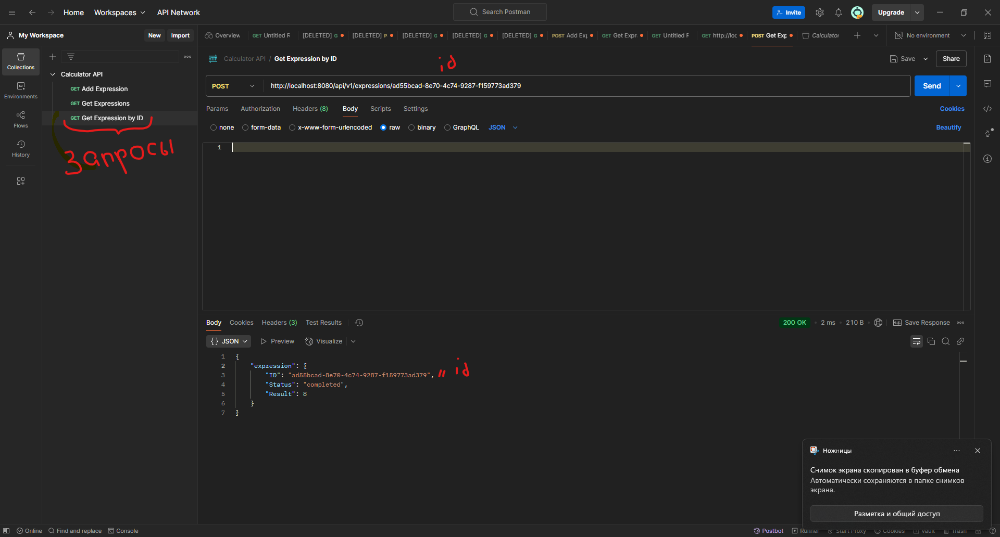

# Распределенный калькулятор арифметических выражений

Этот проект представляет собой распределенный калькулятор, который вычисляет арифметические выражения. Сервер принимает выражения, вычисляет их и возвращает результат. Выражения могут включать сложение, вычитание, умножение, деление и скобки.

---

## Возможности проекта

- **Добавление выражения**: Пользователь может отправить арифметическое выражение для вычисления.
- **Получение списка выражений**: Пользователь может получить список всех выражений с их статусами и результатами.
- **Получение выражения по ID**: Пользователь может получить информацию о конкретном выражении по его ID.
- **Автоматическое вычисление**: Выражения вычисляются автоматически с использованием библиотеки `govaluate`.
- **Обработка ошибок**: Сервер корректно обрабатывает некорректные выражения и возвращает соответствующие ошибки.

---

## Запуск проекта

1. Убедитесь, что у вас установлен Go (версия 1.21 или выше).
2. Клонируйте репозиторий:
   ```bash
   git clone https://github.com/Egor213312/Sprint3.git

3. Установите зависимости:   
    go mod tidy

4. Запустите сервер:
    go run ./cmd/calc_service/main.go

Сервер запустится на http://localhost:8080

---

## **Тестирование с помощью Postman**

1. Добавление выражения

**В postman создайте первый запрос**

Метод: POST

URL: http://localhost:8080/api/v1/calculate

Тело запроса (JSON):

{
  "expression": "2 + 2 * 2"
}

**Нажмите SEND**

Ожидаемый ответ:

{
  "id": "76b594dc-366d-4f01-9628-e0b7d591276d" //нужен для вычисления выражения по id
}

2. Получение списка выражений

**В postman создайте второй запрос**

Метод: GET

URL: http://localhost:8080/api/v1/expressions

**нажмите SEND**

Ожидаемый ответ:

{
  "expressions": [
    {
      "id": "76b594dc-366d-4f01-9628-e0b7d591276d", 
      "status": "completed",
      "result": 6
    }
  ]
}

3. Получение выражения по ID

**В postman создайте третий запрос**

Метод: GET

URL: http://localhost:8080/api/v1/expressions/{id}

Ожидаемый ответ:


{
  "expression": {
    "id": "76b594dc-366d-4f01-9628-e0b7d591276d",
    "status": "completed",
    "result": 6
  }
}




---

## Тестирование с помощью curl
1. Добавление выражения

curl --location 'http://localhost:8080/api/v1/calculate' \
--header 'Content-Type: application/json' \
--data '{
  "expression": "2 + 2 * 2"
}'

2. Получение списка выражений

curl --location 'http://localhost:8080/api/v1/expressions'

3. Получение выражения по ID

curl --location 'http://localhost:8080/api/v1/expressions/{id}'

---

## **Обработка ошибок**
Некорректное выражение
Пример запроса:

{
  "expression": "2 + * 2"
}
Ожидаемый ответ:

Код ответа: 422 Unprocessable Entity

Тело ответа: Invalid expression

Несуществующий ID выражения
Пример запроса:


http://localhost:8080/api/v1/expressions/999
Ожидаемый ответ:

Код ответа: 404 Not Found

Тело ответа: Expression not found

## **Зависимости**
## Библиотеки:

github.com/Knetic/govaluate — для вычисления арифметических выражений.

github.com/google/uuid — для генерации уникальных ID.
